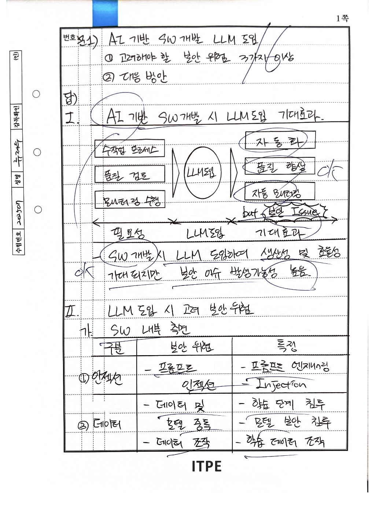
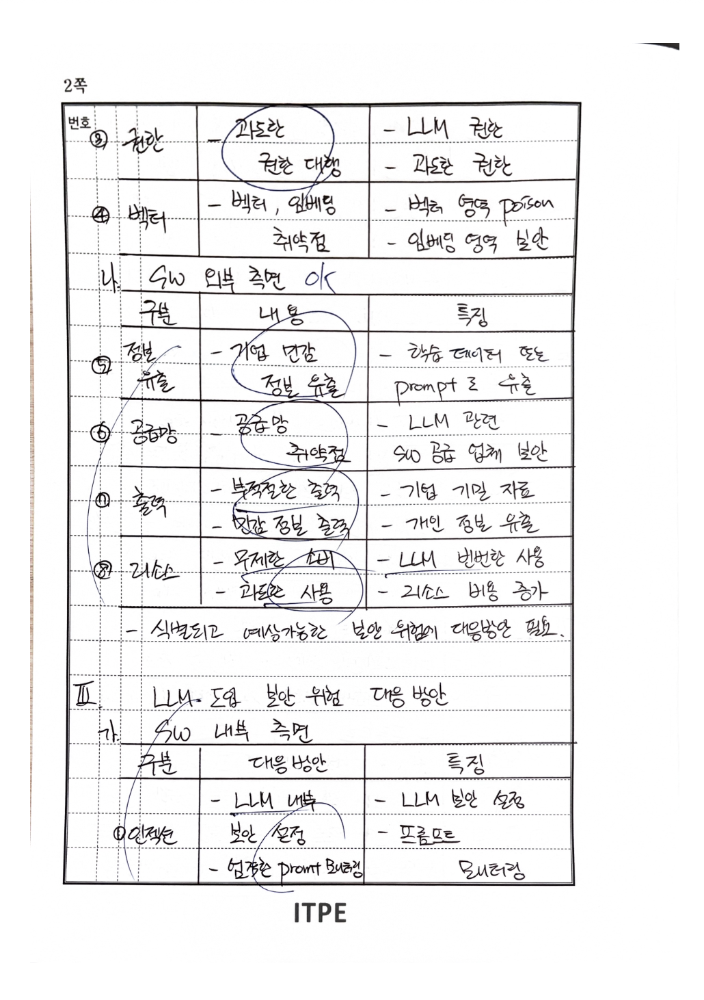
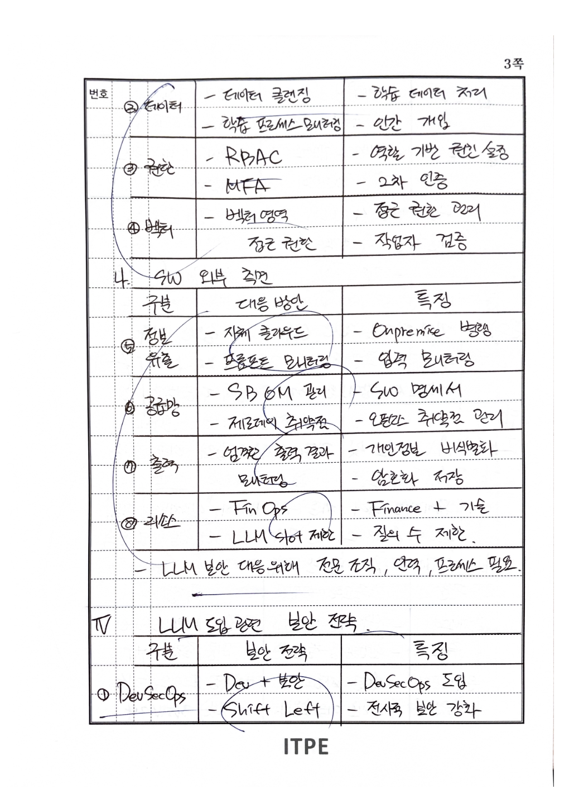
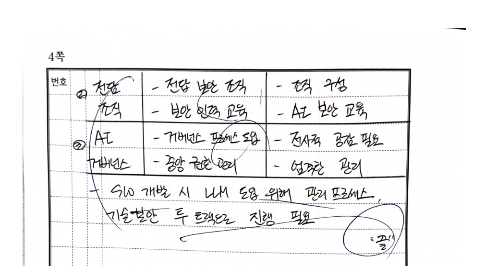

# AI 기반 SW개발 LLM 도입 시 보안 위험과 대응방안
{: .no_toc }

136회 정보관리기술사 2교시 3번
{: .label .label-blue }

서술형 (2~4교시)
{: .label .label-red }

---

## ✅ 문제

AI 기반 소프트웨어 개발에서 LLM(Large Language Model)을 도입할 때 고려해야 할 보안 위험을 3가지 이상 쓰고 각 대응 방안을 설명하시오

---

## 📚 목차
{: .no_toc .text-delta }

- [🎓 Quick 개념잡기](#-quick-개념잡기-클릭해서-펼치기)
- [🎯 기술사 수준 설명](#-기술사-수준-설명)

---

<h2 style="display:inline" id="-quick-개념잡기-클릭해서-펼치기">🎓 Quick 개념잡기 (클릭해서 펼치기)</h2>

### 한 줄 정의
> **LLM 보안**: SW 개발에 LLM 도입 시 발생하는 **보안 위험을 식별하고 대응**하는 체계

### 쉬운 비유
- LLM 보안 = "AI 개발도구에 **보안 잠금장치**를 다는 것"

### 왜 중요한가? (3줄 요약)
- SW 개발 시 LLM 도입으로 **생산성/효율성** 향상이 기대되지만,
- **프롬프트 인젝션, 데이터 유출, 공급망 위협** 등 보안 이슈 발생 가능성이 높음
- 따라서 **내부/외부 측면**에서 보안 위험을 식별하고 대응방안을 마련해야 함

---

## 🎯 기술사 수준 설명
{: #-기술사-수준-설명}

### 📌 핵심 암기 (Quick Reference)

{: .highlight }
> **LLM 보안**: SW 개발 시 LLM 도입에 따른 보안 위험 식별 및 대응
> - (1) `인데권벡 / 정공출리` (보안 위험 8가지)
>   - **SW 내부**: **인**(인젝션) → **데**(데이터) → **권**(권한) → **벡**(벡터)
>   - **SW 외부**: **정**(정보유출) → **공**(공급망) → **출**(출력) → **리**(리소스)
> - (2) `인데권벡 / 정공출리` (대응방안 - 위험별 매칭)
> - (3) `DevSec전AI` (보안 전략)
>   - **DevSecOps** → **전**담조직 → **AI 거버넌스**
> - ⭐ **차별점**: OWASP LLM Top 10 기반 체계적 위험 분류

---

## Ⅰ. AI 기반 SW개발 시 LLM 도입 기대효과

### 1) 필요성 → LLM 도입 → 기대효과

| 필요성 | LLM 도입 | 기대효과 |
|:--|:--|:--|
| 수작업 프로세스 | | 자동화 |
| 품질 검토 | **LLM** | 품질 향상 |
| 문서작성 수행 | | 자동 문서작성 |

{: .warning }
> **But! 보안 Issue**
> SW 개발 시 LLM 도입하여 **생산성 및 효율성**이 기대되지만, **보안 이슈 발생가능성 높음**

---

## Ⅱ. LLM 도입 시 고려 보안 위험

### 가. SW 내부 측면 `인데권벡`

| 구분 | 보안 위험 | 특징 |
|:--|:--|:--|
| **① 인젝션** | 프롬프트 인젝션 | 프롬프트 엔지니어링, Injection 공격 |
| **② 데이터** | 데이터 및 모델 중독, 데이터 조작 | 학습 단계 침투, 모델 보안 침투, 학습 데이터 조작 |
| **③ 권한** | 과도한 권한 대행 | LLM 권한, 과도한 권한 |
| **④ 벡터** | 벡터, 임베딩 취약점 | 벡터 영역 Poison, 임베딩 영역 보안 |

### 나. SW 외부 측면 `정공출리`

| 구분 | 내용 | 특징 |
|:--|:--|:--|
| **⑤ 정보유출** | 기업 민감 정보 유출 | 학습 데이터 탈취, Prompt로 수출 |
| **⑥ 공급망** | 공급망 취약점 | LLM 관련, SW 공급 업체 보안 |
| **⑦ 출력** | 부적절한 출력, 민감 정보 출력 | 기업 기밀 자료, 개인 정보 유출 |
| **⑧ 리소스** | 무제한 소비, 과도한 사용 | LLM 빈번한 사용, 리소스 비용 증가 |

{: .important }
> 식별되고 예상가능한 보안 위험에 **대응방안 필요**

---

## Ⅲ. LLM 도입 보안 위험 대응 방안

### 가. SW 내부 측면

| 구분 | 대응 방안 | 특징 |
|:--|:--|:--|
| **① 인젝션** | LLM 내부 보안 설정, 엄격한 Prompt 필터링 | LLM 보안 설정, 프롬프트 필터링 |
| **② 데이터** | 데이터 클렌징, 학습 프로세스 모니터링 | 학습 데이터 처리, 인간 개입 |
| **③ 권한** | RBAC, MFA | 역할 기반 권한 설정, 2차 인증 |
| **④ 벡터** | 벡터영역 접근 권한, 작업자 검증 | 접근 권한 관리, 작업자 검증 |

### 나. SW 외부 측면

| 구분 | 대응 방안 | 특징 |
|:--|:--|:--|
| **⑤ 정보유출** | 자체 클라우드, 프롬프트 모니터링 | On-premise 병행, 엄격 모니터링 |
| **⑥ 공급망** | SBOM 관리, 제3자와 취약점 | SW 명세서, 오픈소스 취약점 관리 |
| **⑦ 출력** | 엄격한 출력 결과 모니터링 | 개인정보 비식별화, 암호화 저장 |
| **⑧ 리소스** | FinOps, LLM 사용 제한 | Finance + 기술, 질의 수 제한 |

{: .important }
> LLM 보안 대응위해 **전문 조직, 역량, 프로세스** 필요

---

## Ⅳ. LLM 도입 관련 보안 전략 `DevSec전AI`

| 구분 | 보안 전략 | 특징 |
|:--|:--|:--|
| **① DevSecOps** | Dev + 보안, Shift Left | DevSecOps 도입, 전사적 보안 강화 |
| **② 전담조직** | 전담 보안 조직, 보안 인력 교육 | 전직 구성, AI 보안 교육 |
| **③ AI 거버넌스** | 거버넌스 프로세스 도입, 중앙 권한 관리 | 전사적 공감 필요, 엄격한 관리 |

{: .note }
> SW 개발 시 LLM 도입 위해 **관리 프로세스**, **기술/보안 투 트랙**으로 진행 필요

---

## Ⅴ. OWASP LLM Top 10 (2025)

### 1) OWASP LLM Top 10 취약점 목록

| 순위 | 취약점 | 설명 |
|:--|:--|:--|
| **LLM01** | Prompt Injection | 악의적 프롬프트로 LLM 동작 조작 |
| **LLM02** | Sensitive Information Disclosure | 민감 정보(PII, 기업비밀) 노출 |
| **LLM03** | Supply Chain Vulnerabilities | 서드파티 모델/데이터/플러그인 취약점 |
| **LLM04** | Data and Model Poisoning | 학습 데이터/모델 오염으로 악성 행동 유발 |
| **LLM05** | Improper Output Handling | LLM 출력의 부적절한 처리로 XSS/SSRF 유발 |
| **LLM06** | Excessive Agency | LLM에 과도한 권한/자율성 부여 |
| **LLM07** | System Prompt Leakage | 시스템 프롬프트 유출로 보안정책 노출 |
| **LLM08** | Vector and Embedding Weaknesses | RAG용 벡터DB/임베딩 취약점 |
| **LLM09** | Misinformation | 잘못된/환각 정보 생성 |
| **LLM10** | Unbounded Consumption | 무제한 리소스 소비로 DoS/비용 폭증 |

### 2) OWASP LLM Top 10 vs 본 답안 매핑

| OWASP | 본 답안 위험 | 대응방안 |
|:--|:--|:--|
| **LLM01** Prompt Injection | ① 인젝션 | LLM 내부 보안, Prompt 필터링 |
| **LLM02** Sensitive Info Disclosure | ⑤ 정보유출 | 자체 클라우드, 프롬프트 모니터링 |
| **LLM03** Supply Chain | ⑥ 공급망 | SBOM 관리, 취약점 관리 |
| **LLM04** Data/Model Poisoning | ② 데이터 | 데이터 클렌징, 학습 모니터링 |
| **LLM05** Improper Output | ⑦ 출력 | 출력 모니터링, 비식별화 |
| **LLM06** Excessive Agency | ③ 권한 | RBAC, MFA |
| **LLM07** System Prompt Leakage | ① 인젝션 (연관) | Prompt 필터링, 보안 설정 |
| **LLM08** Vector/Embedding | ④ 벡터 | 벡터영역 접근 권한, 작업자 검증 |
| **LLM09** Misinformation | ⑦ 출력 (연관) | 출력 검증, 팩트체크 |
| **LLM10** Unbounded Consumption | ⑧ 리소스 | FinOps, 사용 제한 |

### 3) OWASP LLM Top 10 대응방안 상세

| OWASP 취약점 | 대응방안 | 구현 예시 |
|:--|:--|:--|
| **LLM01** Prompt Injection | 입력 검증, 특권 분리, HITL | 프롬프트 필터, Guardrail, 사용자 확인 |
| **LLM02** Sensitive Info | 데이터 마스킹, 접근통제 | PII 마스킹, 출력 필터링, DLP |
| **LLM03** Supply Chain | SBOM, 서명검증, 샌드박스 | 버전 고정, 승인 레지스트리, 격리 실행 |
| **LLM04** Data Poisoning | 데이터 검증, 출처 추적 | 클렌징 파이프라인, 데이터 계보 |
| **LLM05** Improper Output | 출력 인코딩, 컨텍스트 검증 | XSS 방어, 신뢰경계 분리 |
| **LLM06** Excessive Agency | 최소권한, 승인 플로우 | RBAC, 중요 작업 승인 |
| **LLM07** Prompt Leakage | 시스템 프롬프트 보호 | 프롬프트 분리, 메타데이터 제거 |
| **LLM08** Vector/Embedding | 벡터DB 접근통제, 무결성 | 임베딩 서명, 접근 감사 |
| **LLM09** Misinformation | RAG, 출처 검증, 불확실성 표시 | 외부 지식 연동, 신뢰도 라벨 |
| **LLM10** Unbounded Consumption | 레이트리밋, 쿼터, 모니터링 | API 제한, 비용 알림, FinOps |

---

## 참고(가산점 포인트)

- OWASP LLM Top 10은 **2023년 v1.0 → 2025년 v2.0**으로 업데이트됨
- LLM 보안은 **기술적 대응 + 조직/프로세스 대응**이 함께 필요
- **DevSecOps + AI 거버넌스**로 전사적 보안 체계 구축 권장

---

### ✅ 학습 체크리스트

- [ ] LLM 도입 기대효과와 보안 이슈 관계 설명 가능
- [ ] SW 내부 측면 보안 위험 `인데권벡` 암기
- [ ] SW 외부 측면 보안 위험 `정공출리` 암기
- [ ] 각 위험에 대한 대응방안 매칭 가능
- [ ] 보안 전략 `DevSec전AI` 암기
- [ ] OWASP LLM Top 10 주요 항목 설명 가능
- [ ] OWASP 취약점과 본 답안 위험의 매핑 관계 이해

